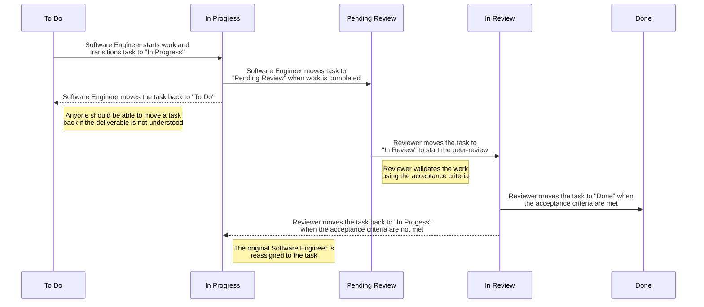

# [DRAFT] Simple Software Development Workflow

This repository describes a simple (agile) software development workflow with
peer-reviewing to use within your organisation.

The success of any software development workflow requires that you have an
understanding of what the desired outcome is for a task, and how to measure
that the desired outcome was achieved. There are various ways to do this, and
determining what fits your organisation and engineering team is up to you.

This workflow is usable for bugs, tasks (chores) and subtasks of stories.

## Prerequisites

It is recommended to only use this software development workflow when:
- the team consists of 4 software engineers or more
- the team has agreed on how to measure success
- the team uses hours for estimations, not story points

## Understandings

This software development workflow is limited to the development of software,
and does not cover anything related to deployment of the software, nor does it
take into account refinement of the work.

A templated software development workflow may be a good start for your business
but feel free to experiment and try variants or combinations of different ways
of working.

## Definitions

Assignment
: The commitment to working on a task. Assignment of a task must be visible
  within the issue and/or project tracking system.

Resolution
: The course of action determined or decided on.

Reviewer
: The person reviewing the work of a software engineer.

State
: A state in which a task is either ready to be worked on or actively being
  worked on.

Story
: A single deliverable consisting of multiple units of work (subtasks).

Task
: A single unit of work with a single deliverable estimated to no more than
  5 hours of work.

Transition
: Changing a task from one state to another.

## Schematic overview

The schema below provides an overview of this software development workflow:

## The workflow in detail

The summary below gives detailed insight into each of the states used in the
software development workflow.

Although some organisations may need to deviate in some of the areas, mostly
because of resource constraints, please be aware that separation of duties when
implementing this workflow are aimed to improve sharing of knowledge within a
team, and ensure agreed upon quality standards are met.

Some management systems, such as ISO 27001 and 9001, will require some of these
practises to be thought of and/or in place within your organisation.

Always ensure that separation of duties within any workflow is enforced within
the issue and/or project tracking system of your choice.

### To Do

The "To Do" state indicates that a task is ready to be worked on. Any software
engineer should be able to work on these tasks.

To ensure that any software engineer within the team is able to start work on a
task, it is important to have a proper description of what the desired goal of
that task is. Tasks that do not have a clear and understandable description of
what the deliverable is, should not be in the "To Do" state.

Organisations may vary on how the deliverable is described for a task, and many
teams have different preferences on what works for them. Generally speaking it
works well to have some background information on why specific work should be
done, what the desired implementation is to meet a certain demand and what the
benefit is of completing the work.

Although teams may differ in their approach to capture the requirements for a
task, it's generally a good practise to keep any description short and to the
point. Checklists may work very well for some teams.

While a task is in the "To Do" state it is not assigned to anyone.

### In Progress

The "In Progress" state indicates that a task is currently being worked on. All
tasks in this state must be assigned to a software engineer.

The software engineer should follow the development procedure that was agreed
upon by the whole team. The development procedure should provide guidelines on
coding standards, test requirements and general best practises.

A software engineer could discover impediments when working on a task. While
most of these impediments may be resolved within a reasonable amount of time,
and resolving those impediments may not affect the estimation (by much), there
should be a possibility for a software engineer to directly transition a task
back to "To Do" or "Done". In the latter case, the software engineer should
apply a resolution like "Abandoned" with an explanation.

Valid reasons of moving a task back or directly to "Done" are:
- During development the software engineer spots an issue in the affected code
  that will exceed the estimate by more than is reasonable
- The desired outcome of the task, while in development, is incomplete and must
  be refined (again) to ensure everyone is aligned on the deliverable

Transitioning a task from this state to "To Do" or "Done" is a deviation of the
workflow and must be escalated to the other team members.

### Pending Review

Similar to the "To Do" state, the "Pending Review" state indicates that a task
is ready to be worked on. The initial work on the task is done, and before the
task is moved to "Done" someone else should review the work to ensure that the
developed work satisfies all agreed upon criteria.

During this state the work is not assigned to anyone.

### In Review

The "In Review" state indicates that a task is currently being reviewed. All
tasks in this state must be assigned to a Reviewer.

During the "In Review" state the Reviewer validates that the work meets all
agreed upon criteria. The Reviewer must provide comments in the version control
system for any criteria that were not met. These comments must be passed to the
original software engineer.

If there are any comments on the task, the Reviewer will transition the task
back to "In Progress" and assign the original software engineer.

To ensure quality it is most important to ensure that it is not possible for
any software engineer to review their own work. While some organisations may
have a dedicated role for quality assurance, smaller organisations may choose
to have this responsibility shared by people with the same role.

### Done

When the Reviewer has ensured that the task has been completed in accordance
with the criteria that were agreed upon, the task must be moved to "Done".

Tasks moved to this state must be unassigned.

Although development work on the task has been completed, and peer-review has
not discovered any missed acceptance criteria, there may be other work that
must be done on the task to complete the work as a whole. "Done" within this
workflow means that the software engineering work has been completed.

Tasks in the "Done" state may be the starting state for any other related
workflows, like a deployment pipeline.

## Reviewing

The peer-review process ensures that quality standards are met for every change
to the software, but if not done correctly it could result into a lot of spent
time without any concrete benefits.

To keep up productivity while guarding quality, consider the review process a
collaboration between the original software engineer and a Reviewer. The people
involved for a single task should not change, and the team should be aware of
who are responsible for the delivery of a task.

For the first review the Reviewer must provide comments to the software in the
version control system. The original software engineer will aim to resolve any
comments made by the Reviewer, after the Reviewer has transitioned the task
back to "In Progress" and reassigned the original software engineer. When all
the comments have been resolved, the task is transitioned according to the
workflow - as described above.

The Reviewer should watch for any tasks that are transitioned to the "Pending
Review" state that the Reviewer previously reviewed. These tasks should be
reviewed again by the same Reviewer.

If any issues are found during the second review, the Reviewer should consider
working directly together with the original software engineer to resolve any
remaining issues.

## Estimations and velocity

As defined in the Definitions section (see above), it should be possible to
complete work on a task within 5 hours. Most companies have working days of 8
hours, which means that most tasks can be finished within a single working day.

Software engineering frequently requires making modifications to many different
parts of a software application. There may be people in your team that thrive
on elaborate changes, but for others it might be daunting. If work is left in
an unfinished state at the end of a working day, the software engineering that
is working on the task will need to read into the changes the next day. This
takes time, and increases the change of making mistakes.

Tasks that exceed the desired 5-hour limit should be split up. Deliverables
that need to be split up should be combined into a story.

### Preparation

Before commencing with any work, try to set an expectation of what you have to
do to complete the work and meet the desired goal.

From a development perspective, some of these questions might help:
- Which areas of the software application do you expect to be working on?
- Which other components / areas of the software application are related to the
  area you are expecting to work on?
- Are you expecting to primarily add, change or delete code?
- What is the coverage level of the code you are expecting to work on?
- Do you understand the purpose / business logic of the requested change?
- Are there any other pending tasks that will make changes to the same parts of
  the software application?
- Do I know who to reach out to if I come across any blockers[^1]?

[^1]: A blocker does not have to be technical, be sure to have people to
reach out to with any type of blocker.
