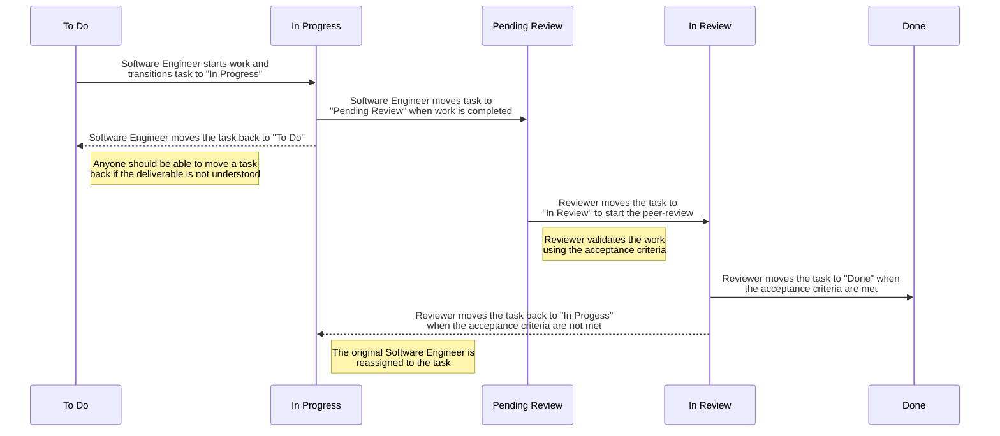

# Engineering process

The schema below provides an overview of this software development workflow:

## Statuses

### To-Do
> The "To-Do" state indicates that an issue is ready to be worked on. Any software engineer should be able to work on
> these issues

Issues in the To-Do state must have a clear description of the deliverable and have a set of (no more than 5) acceptance
criteria. The team must have confirmed that both are _understandable_.

Descriptions should be kept short and on point, as to ensure they are easy to digest. Some background information on why
the deliverable is important (to the end-user) may allow a Software Engineer to think about a "better" solution. Short
lists work very well for some teams as well.

Issues that fail to meet the criteria above must not be in the "To-Do" state.

### In Progress
> The "In Progress" state indicates that an issue is currently being worked on. Issues in this state must be assigned to
> a software engineer

The Software Engineer must follow the coding standards, test requirements and general best practises agreed upon by the
whole team.

Impediments discovered while the issue is being worked on, that cannot be resolved without exceeding the original estimate
(by much), should be transitioned to "To-Do" or "Done".

Valid reasons of moving a task back or directly to "Done" are:
- During development the software engineer spots an issue in the affected code that will exceed the estimate by more than
is reasonable
- The desired outcome of the task, while in development, is found to be incomplete and must be refined more to ensure
everyone is aligned on the deliverable

Transitioning a task from this state to "To-Do" or "Done" is a deviation of the workflow and must be escalated to the
other team members.

### Pending Review
> The "Pending Review" state indicates that an issue is ready to be reviewed. Any software engineer, except the person
> who did the initial work on the issue, should be able to review it

A Software Engineer must review an issue that is in the "Pending Review" state before starting on any new issue that are
in the "To-Do" state. This approach reduces work that is in progress.

The team must ensure that all issues in the "Pending Review" state are reviewed before the end of the working day.

### In Review
> The "In Review" state indicates that an issue is currently being reviewed. Issues in this state must be assigned to a
> software engineer

During the "In Review" state the Reviewer validates that the work meets all agreed upon criteria. The Reviewer must
provide comments in the version control system for any criteria that were not met. These comments must be passed to the
original software engineer.

If there are any comments on the task, the Reviewer will transition the task back to "In Progress" and assign the
original software engineer.

To ensure quality it is most important to ensure that it is not possible for any software engineer to review their own
work. While some organisations may have a dedicated role for quality assurance, smaller organisations may choose to have
this responsibility shared by people with the same role.

### Done
> The "Done" state indicates that (engineering) work on an issue has been completed, and that the work meets all agreed
> upon acceptance and coding criteria

Issues in the "Done" state do not require any more engineering work. Any follow-up work that is required for a
deliverable, such as deployment of the changes, must be handled outside of this workflow.

## Roles

The workflow depends on a few roles. Team members may fulfill multiple roles, however a team member may only fulfill a
single role per Unit of Work.

> Separation of Duties (SoD) is one of the components of risk management, and depends on the concept of always having
> more than one person required to complete a task.

A unit of work requires two roles: a _Software Engineer_ (the person who does the work) and a _Reviewer_ (the person who
checks it). Completing a unit of work depends on the collaboration between these roles. The people fulfilling these roles
for a single unit of work should not change.

For deliverables that consist of multiple units of work, a _Team Lead_ is required to oversee the successful integration
of each completed unit of work, and as such reviews the units of work as another unit of work.
